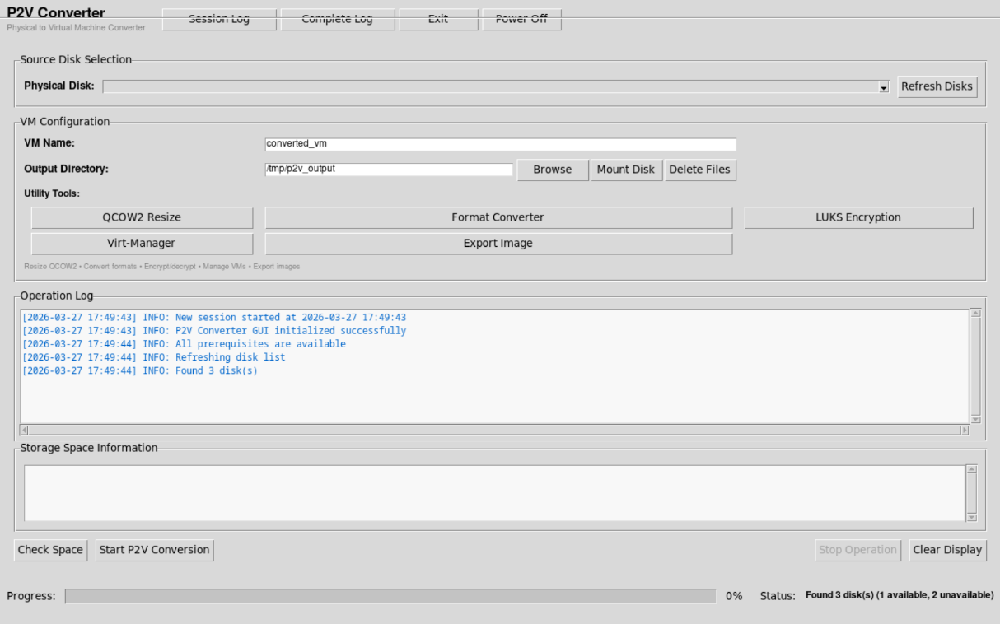
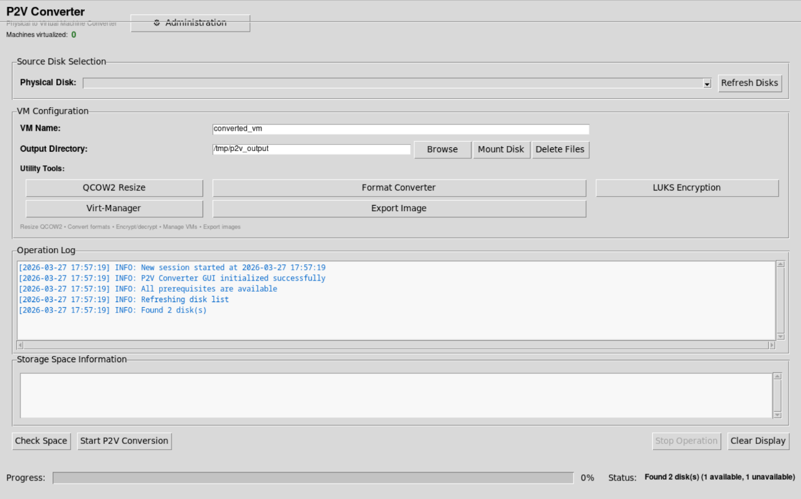

# P2V Converter – Turn Physical Machines into Virtual Ones

Transform physical disks into **qcow2 virtual machine images** ready for any hypervisor. Safety-focused tool with intuitive GUI, preventing accidental imaging of running systems. Build a **bootable ISO** for safe offline conversion of any physical machine.

***

## Features

### Core Conversion
- Converts physical disks to **compressed qcow2** images
- Real-time progress tracking with cancel capability
- Blocks conversion of active system disks and mounted partitions
- Intelligent space analysis based on actual usage
- Comprehensive logging to `/var/log/disk2qcow2.log`

### Advanced Tools
- **QCOW2 Resizer**: Optimize virtual disk size
- **Format Converter**: Convert between qcow2, vmdk, vdi, vpc, vhdx, raw
- **LUKS Encryption**: Secure VMs with password-protected containers
- **Export Manager**: Transfer images via RSYNC
- **File Manager**: Workspace cleanup
- **Virt-Manager Integration**: Direct VM management
- **External Storage Support**: Mount and use external drives

### Supported Operating Systems
- **Windows** (all versions - XP through 11, Server editions)
- **Linux** (all distributions - Ubuntu, Debian, Fedora, CentOS, Arch, etc.)

***

## Live vs Installer mode
Pre-built 64 bits ISO comes with two boot modes integrated.

### Live mode
Live mode is advised when virtualizing a machine by directly booting on the target system via a bootable USB key containing the ISO. The virtualization process runs entirely from the live environment without any installation required on the host machine.

Users have access to all features, including the ability to export logs to an external storage device before shutting down the session.

<div style="display: flex; align-items: center;">
  
</div>

### Installer mode
Installer mode is designed for use as a **fixed virtualization workstation**, where physical drives removed from their original machines are connected directly to the station for virtualization. This mode is intended for a permanent, dedicated setup rather than on-site interventions.

All features are available to the user, with the exception of the following operations which are **restricted to administrator access (password protected)**:

| Protected action | Reason |
|---|---|
| Log export from the station | Prevent unauthorized data extraction |
| Log purge | Preserve audit trail integrity |
| System restart & shutdown | Ensure workstation availability |
| Exiting kiosk mode | Maintain controlled environment |

<div style="display: flex; align-items: center;">
  
</div>

### Quick comparison

| | Live mode | Installer mode |
|---|---|---|
| **Use case** | On-site, boot on target machine | Fixed workstation, attach external drives |
| **Installation required** | No | Yes |
| **Log export** | ✅ User | 🔒 Admin only |
| **Log purge** | ✅ User | 🔒 Admin only |
| **Restart / Shutdown** | ✅ User | 🔒 Admin only |
| **Exit kiosk mode** | ✅ User | 🔒 Admin only |
| **Virtualize disk** | ✅ User | ✅ User |
| **Resize VM filesystem** | ✅ User | ✅ User |
| **Convert VM image format** | ✅ User | ✅ User |
| **Cipher VM image** | ✅ User | ✅ User |
| **Start VM on Qemu** | ✅ User | ✅ User |

## Quick Start

### Download Pre-built ISO (Recommended)
**[Download P2V Converter ISO](https://archive.org/details/p2vConverter-v2.0)**

  ```txt
  - p2vConverter-v2.0-64bits.iso : c4e3a7f52f865ccdca4438b020bc805d9dcc33d4c2d666f621706918783ef995
  - p2vConverter-v2.0-32bits.iso : 880f6c004b712f0b35a5291b56cd0012869c2200f13092633d3769818265da6e
  ```

Select ISO version you need, 32 bits or 64 bits, XFCE (lighter) or KDE. 
### Or Build Your Own

```bash
cd iso/
make
make xfce32  # 32 bits XFCE environment (lighter)
make kde     # KDE 64 bits environment
make kde32   # KDE 32 bits environment
make all-iso # All 4 ISOs generated
make clean   # Clean build files
make help    # Display helper message
```

***

## Requirements

### ISO Method (Recommended - No Configuration)
- USB drive (8GB+) or DVD
- External storage drive for output
- No additional setup needed

### Native Installation

**Ubuntu/Debian:**
```bash
sudo apt install qemu-utils python3-tk gparted rsync cryptsetup virt-manager libvirt-daemon-system
```

**Fedora/CentOS/RHEL:**
```bash
sudo dnf install qemu-img python3-tkinter gparted rsync cryptsetup virt-manager libvirt
```

**⚠️ Critical for External Storage:** Configure libvirt to access external drives:

```bash
sudo nano /etc/libvirt/qemu.conf

# Add/modify these lines:
user = "root"
group = "root"

cgroup_device_acl = [
    "/dev/null", "/dev/full", "/dev/zero",
    "/dev/random", "/dev/urandom",
    "/dev/ptmx", "/dev/kvm",
    "/dev/rtc", "/dev/hpet",
    "/dev/sdb", "/dev/sdc", "/dev/sdd",  # Your external drives
    "/dev/disk/by-uuid/*"
]
````
```bash
sudo systemctl restart libvirtd
sudo usermod -a -G libvirt $USER
```

## Usage Workflow

### 1. Boot from ISO
- Write ISO to USB: `sudo dd if=p2v-converter.iso of=/dev/sdX bs=4M status=progress` (or use [Ventoy key](https://www.ventoy.net/en/))
- Boot target machine from USB

### 2. Connect External Storage
- Plug in external USB drive (don't mount manually)

**Mount External Storage:**
- Click **"Mount Disk"** button
- Select your external drive
- Click "Mount Selected Disk"
- Output directory updates automatically

### 3. Configure Conversion

**Select Source:**
- Click **"Refresh Disks"**
- Select disk to convert (system disks blocked for safety)

**Verify Space:**
- Click **"Check Space Requirements"**
- Green indicator = sufficient space

### 4. Convert
- Click **"Start P2V Conversion"**
- Monitor progress (cancel anytime if needed)
- Typical time: 30-120 minutes depending on size and system

### 5. Optional Post-Processing
- **"QCOW2 Resize"**: Optimize disk size (change filesystem size, reduce virtual size and compress virtual image)
- **"LUKS Encryption"**: Secure with password
- **"Format Converter"**: Convert to VMDK/VDI/VHD
- **"Export Image"**: Transfer via RSYNC
- **"Print Session Log"**: Generate PDF report

***

## Running Converted VMs

### Using virt-manager

```bash
# From ISO (auto-configured) or native installation:
virt-manager

# Then in GUI:
# 1. New VM → Import existing disk image
# 2. Browse to .qcow2 file
# 3. Select OS type (Windows or Linux)
# 4. Choose firmware:
#    - UEFI for modern systems (2010+)
#    - BIOS for legacy systems
# 5. DISABLE Secure Boot
# 6. Start VM
```

### Using QEMU CLI

**BIOS boot:**
```bash
qemu-system-x86_64 -m 4096 -drive file=vm.qcow2,format=qcow2 -enable-kvm
```

**UEFI boot:**
```bash
qemu-system-x86_64 -m 4096 \
  -drive file=vm.qcow2,format=qcow2 \
  -drive if=pflash,format=raw,readonly=on,file=/usr/share/OVMF/OVMF_CODE.fd \
  -enable-kvm
```

**From external drive:**
```bash
sudo mount /dev/sdb1 /mnt/external
qemu-system-x86_64 -m 4096 -drive file=/mnt/external/vm.qcow2,format=qcow2 -enable-kvm
```

***

## Format Conversion

| Platform | Format | Command |
|----------|--------|---------|
| VMware | vmdk | `qemu-img convert -f qcow2 -O vmdk src.qcow2 output.vmdk` |
| VirtualBox | vdi | `qemu-img convert -f qcow2 -O vdi src.qcow2 output.vdi` |
| Hyper-V | vhdx | `qemu-img convert -f qcow2 -O vhdx src.qcow2 output.vhdx` |
| Generic | raw | `qemu-img convert -f qcow2 -O raw src.qcow2 output.img` |

Or use the GUI **"Format Converter"** tool.

***

## Troubleshooting

### Common Issues

**"Disk Unavailable"**
- Boot from ISO to convert system disks
- Unmount partitions: `sudo umount /dev/sdX1`

**"Insufficient Space"**
- Use "Mount Disk" for larger external drive
- Check available space matches requirement

**"Cannot Mount External Drive"**
- Verify detection: `lsblk`
- Unmount if already mounted: `sudo umount /dev/sdX1`

**"VM Won't Boot"**
- Try both UEFI and BIOS modes
- Disable Secure Boot
- Windows may need reactivation after conversion

**"Permission Denied" (native installation)**
- Configure libvirt as shown in Requirements
- Or run with: `sudo python3 code/main.py`

**"External Drive VM Fails to Start"**
- Native installation: Configure libvirt `cgroup_device_acl`
- ISO method: No configuration needed

### Windows-Specific Issues

**"Windows requires activation"**
- Normal after hardware change
- Use original product key to reactivate or **slmgr /rearm** command

**"Missing drivers after boot"**
- Install virtio drivers in guest
- Or use IDE disk mode in VM settings

**"BSOD on first boot"**
- Use BIOS mode instead of UEFI
- Disable virtio, use IDE initially

### Logs

Check `/var/log/disk2qcow2.log` for detailed diagnostics or use "Print Session Log" for PDF reports.

***

## Project Structure

```
disk2qcow2/
├── code/                          # Application
│   ├── main.py                    # Entry point
│   ├── p2v_dialog.py              # Main GUI
│   ├── vm.py                      # Conversion engine
│   ├── utils.py                   # Disk utilities
│   ├── log_handler.py             # Logging & PDF
│   ├── disk_mount_dialog.py       # Mount manager
│   ├── qcow2_resize_dialog.py     # Resize tool
│   ├── image_format_converter.py  # Format converter
│   ├── ciphering.py               # LUKS encryption
│   ├── export.py                  # RSYNC export
│   └── virt_launcher.py           # VM management
├── iso/                           # ISO builders
│   ├── forgeIsoKde.sh             # KDE ISO 64 bits
│   ├── forgeIsoXfce.sh            # XFCE ISO 64 bits
│   ├── forgeIsoKde32.sh           # KDE ISO 32 bits
│   ├── forgeIsoXfc32e.sh          # XFCE ISO 32 bits
│   └── makefile                   # Build automation
└── README.md
```


## Best Practices

✅ Use ISO method for safe conversions  
✅ Use USB 3.0+ external drives for performance  
✅ Create a backup before resizing partitions using **Backup** button
✅ Keep source disk intact until VM validated  
✅ Use LUKS encryption for sensitive systems  
✅ Generate PDF logs for documentation  


## Technical Details

- **Format**: QCOW2 with zlib compression
- **Source Support**: Windows & Linux, any filesystem
- **Log Location**: `/var/log/disk2qcow2.log`
- **GUI**: Python 3 + Tkinter
- **Tools**: qemu-img, cryptsetup, rsync, libvirt, virt-manager, qemu-utils
- **Target Platforms**: QEMU/KVM, VirtualBox, VMware, Hyper-V


## Quick Example

```bash
# 1. Boot from ISO → Launch P2V Converter
# 2. Click "Refresh Disks" → Select /dev/sda (Windows disk)
# 3. Click "Mount Disk" → Select external /dev/sdb1 → Mount at /mnt/external
# 4. Click "Check Space Requirements" → Verify green indicator
# 5. Click "Start P2V Conversion" → Wait ~45 min for 250GB disk
# 6. Click "Print Session Log" → Save PDF report
# 7. Transfer external drive to host system
# 8. Run: qemu-system-x86_64 -m 4096 -drive file=/mnt/external/sda_vm.qcow2 -enable-kvm
```


**Supported Systems:**
- Windows (XP, Vista, 7, 8, 10, 11, Server 2003-2022)
- Linux (Ubuntu, Debian, Fedora, CentOS, RHEL, Arch, openSUSE, etc.)


## License

Attribution-NonCommercial-ShareAlike 4.0 International. See LICENSE file

---

**Transform any Windows or Linux physical machine into a portable virtual environment.**

**[Download P2V Converter ISO](https://archive.org/details/p2vConverter-v0.1)** and start virtualizing today!
